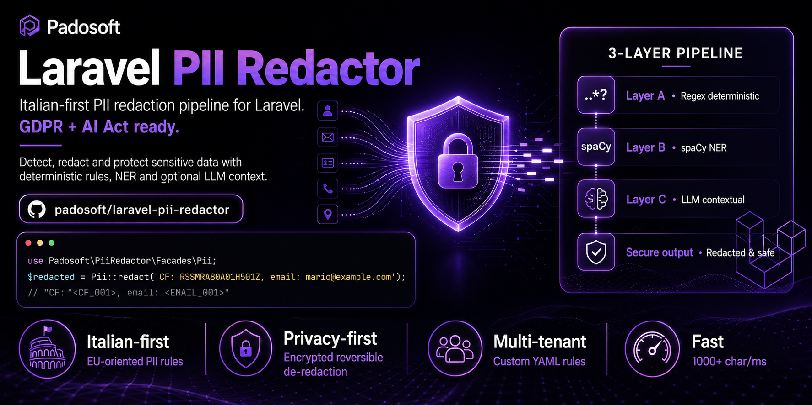
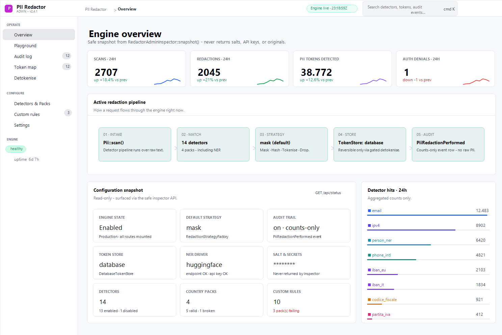

# laravel-pii-redactor

[](https://github.com/padosoft/laravel-pii-redactor/actions/workflows/ci.yml)
[](https://packagist.org/packages/padosoft/laravel-pii-redactor)
[](https://packagist.org/packages/padosoft/laravel-pii-redactor)
[](https://laravel.com)
[](LICENSE)
[](https://packagist.org/packages/padosoft/laravel-pii-redactor)



> **EU-first PII redaction for Laravel — deterministic regex + checksum-validated detectors organised into opt-in country packs (Italy, Germany, Spain ship built-in; France / Netherlands / Portugal land in v1.2+), plus always-on multi-country detectors (email, IBAN mod-97 for every ISO 13616 country, credit card with Luhn) and a pluggable strategy layer (mask / hash / tokenise / drop) with persistent reverse-map storage (memory / database / cache), opt-in HuggingFace + spaCy NER drivers, and YAML custom-rule packs for tenant-specific identifiers. Zero external services in the default path, zero mandatory LLM cost, GDPR + EU AI Act ready.**

`laravel-pii-redactor` is the seventh deliverable of the [Padosoft v4.0 cycle](https://github.com/lopadova/AskMyDocs) (W7). It is a community Apache-2.0 package, **standalone-agnostic** (zero references to AskMyDocs / sister packages), and ships with the Padosoft AI vibe-coding pack so you can extend it with Claude Code or GitHub Copilot in minutes — not days.

```php
use Padosoft\PiiRedactor\Facades\Pii;

$clean = Pii::redact('Codice fiscale RSSMRA85T10A562S, IBAN IT60X0542811101000000123456, mail: mario@example.com.');
// "Codice fiscale [REDACTED], IBAN [REDACTED], mail: [REDACTED]."

$report = Pii::scan('Telefono +39 333 1234567 e P.IVA 12345678903.');
// $report->countsByDetector() === ['phone_it' => 1, 'p_iva' => 1]
```

---

## Table of contents

- [Why this package](#why-this-package)
- [Design rationale](#design-rationale)
- [Features at a glance](#features-at-a-glance)
- [🇪🇺 EU country pack architecture](#-eu-country-pack-architecture)
- [Build your own country pack — 3-step recipe](#build-your-own-country-pack--3-step-recipe)
- [Comparison vs alternatives](#comparison-vs-alternatives)
- [Installation](#installation)
- [Quick start](#quick-start)
- [Usage examples](#usage-examples)
- [Laravel integration recipes](#laravel-integration-recipes)
- [Web Panel UI](#web-panel-ui)
- [Admin panel readiness](#admin-panel-readiness)
- [Configuration reference](#configuration-reference)
- [Architecture](#architecture)
- [AI vibe-coding pack](#ai-vibe-coding-pack)
- [Testing — Default + Live](#testing--default--live)
- [Performance](#performance)
- [Roadmap](#roadmap)
- [Migration guide v0.x → v1.0](#migration-guide-v0x--v10)
- [Contributing](#contributing)
- [Security](#security)
- [License](#license)

---

## Why this package

PII redaction is one of those domains where the existing options force a bad trade-off:

- **Build it yourself** with a few hand-crafted regexes — fast to write, but the moment a real Italian fiscal code shows up (16 alphanumeric characters with a checksum derived from a Decreto Ministeriale lookup table) your "good enough" regex starts emitting false positives that break audits.
- **Reach for Microsoft Presidio / AWS Comprehend / Google DLP** — robust, but they assume a US-centric set of identifiers. None of them validate the Italian `codice fiscale` checksum out of the box, and routing every chat-log line through a hosted PII service is operationally expensive and a GDPR amplifier.
- **Bolt an LLM-based redactor onto the pipeline** — works, but pays per-token to do something that is, fundamentally, a regular language problem.

`laravel-pii-redactor` covers the **deterministic** layer. v1.0 ships:

- **3 always-on multi-country detectors** — `email` (RFC-5321 shape), `iban` (ISO 13616 country-length table + mod-97 for **every** registered country, ~75), `credit_card` (Luhn).
- **3 shipped country packs** (v1.1):
  - **`ItalyPack`** — `codice_fiscale` (CIN checksum), `partita_iva` (Luhn-IT), `phone_it`, `address_it`.
  - **`GermanyPack`** (v1.1) — `steuer_id` (mod-11 ISO 7064 per §139b AO), `ust_idnr` (BMF Method 30 per §27a UStG), `phone_de`, `address_de`.
  - **`SpainPack`** (v1.1) — `dni` (23-letter checksum table per RD 1553/2005), `nie` (prefix-substituted DNI), `cif` (corporate ID), `phone_es`, `address_es`.
- **`PackContract` interface + `DetectorPackRegistry`** — opt-in jurisdiction bundles. Operate in Italy only? Keep `ItalyPack`. Operate across the EU? Add `GermanyPack` / `SpainPack` (shipped v1.1) or `FrancePack` (v1.2+ candidate). Operate outside Italy? Drop `ItalyPack` from the config.
- **4 pluggable replacement strategies** — `mask`, `hash`, `tokenise`, `drop`.
- **3 token-store drivers** — `memory` (default), `database` (Eloquent + shipped migration), `cache` (Redis / Memcached / DynamoDB / array).
- **2 production NER drivers (opt-in)** — `HuggingFaceNerDriver`, `SpaCyNerDriver`. Network calls fail open.
- **YAML custom-rule packs** — register tenant-specific detectors from `*.yaml` files; SP auto-registers when `pii-redactor.custom_rules.auto_register = true`.
- **Typed `DetectionReport`** — audit every redaction without re-running the engine.
- **Admin-ready headless APIs** — safe status snapshots, strategy factory, masked report formatter, token resolution, and custom-rule diagnostics for a separate Laravel 13 React/Tailwind admin package. See [Admin panel readiness](#admin-panel-readiness).

It is **deliberately small** and **deliberately offline by default**. You can extend it with custom detectors via `Pii::extend()` or your own country pack. The deterministic engine fits in ~200 lines of PHP, the v1.0 surface is locked under semver, and 300+ unit tests + a robustness suite describe every transition.

---

## Design rationale

Five non-negotiable choices that drove the API:

### 1. EU-first via opt-in country packs. World-second.

Every PII pipeline I have seen for Laravel either ignores European fiscal data or matches it with a bare regex that returns false positives on every retry CI run. **National identifiers need real code**: the Italian `codice fiscale` requires the official odd/even checksum table from the 1976 Decreto Ministeriale; the German Steuer-ID needs mod-11; the Spanish DNI needs a letter-checksum lookup; the French NIR needs mod-97. A regex alone won't do.

Hence **country packs**. v1.0 shipped `ItalyPack` as the reference implementation (4 Italian detectors with the full CIN checksum + Luhn-IT). v1.1 makes good on the promise with **two more concrete bundles** — `GermanyPack` (Steuer-ID mod-11 ISO 7064 per §139b AO + USt-IdNr BMF Method 30 per §27a UStG + German phone/address) and `SpainPack` (DNI 23-letter checksum table per RD 1553/2005 + NIE + CIF + Spanish phone/address). Both opt-in via a single FQCN in `config('pii-redactor.packs')`. The `PackContract` interface + `DetectorPackRegistry` make it equally trivial for the community to contribute `FrancePack`, `NetherlandsPack`, `PortugalPack` next — each as a self-contained bundle of detectors with checksum-source citations and 10/5 valid/invalid fixtures.

Multi-country detectors (`email`, `iban` with mod-97 for every ISO 13616 country, `credit_card` with Luhn) stay always-on regardless of which packs you load — they have no jurisdictional flavour.

### 2. Deterministic regex + checksum, no LLM in the hot path

Every first-party detector is a pure function of its input. No external HTTP call, no per-token cost, no rate limit. A 1 MB chat log redacts in ~280 ms and the output is identical on every machine. The optional NER layer (v0.3+) ships behind a config switch; the default path never touches a network.

### 3. Strategy is a runtime decision, not a compile-time one

The same detected match can be **masked** (`[REDACTED]` for human-facing logs), **hashed** (`[hash:abc123ef01234567]` for cross-record joins on pseudonymous data), **tokenised** (`[tok:email:abc123ef01234567]` with a reversible salt-derived map for forensic recovery), or **dropped** (empty string for forwarding to lossy systems). Switching strategy is a one-line override on `Pii::redact($text, new HashStrategy(...))` — no detector code changes.

### 4. Detector overlap is resolved deterministically

When two detectors emit overlapping byte ranges (e.g. an email-shaped string that also matches a phone heuristic), the engine keeps the **earlier** match (lower offset) and drops the latecomer. The behaviour is documented, tested, and predictable — callers can audit it via `Pii::scan()`.

### 5. Standalone-agnostic — zero AskMyDocs symbols

`laravel-pii-redactor` is a **community** package. It is not coupled to AskMyDocs, the sister patent-box tracker, the eval-harness, the Regolo driver, or any other Padosoft project. An architecture test (`tests/Architecture/StandaloneAgnosticTest.php`) walks `src/` with `RecursiveDirectoryIterator` on every CI run and asserts the forbidden-substring list (KnowledgeDocument, KbSearchService, AskMyDocs, PatentBoxTracker, LaravelFlow, EvalHarness, Regolo, ...) never appears.

---

## Features at a glance

- **🇪🇺 EU country pack architecture** — `PackContract` interface + `DetectorPackRegistry` boots country packs from `config('pii-redactor.packs')`. **Three packs ship in v1.1**: `ItalyPack` (default), `GermanyPack` (opt-in), `SpainPack` (opt-in). `FrancePack`, `NetherlandsPack`, `PortugalPack` are community PRs welcome (see [CONTRIBUTING-PACKS.md](CONTRIBUTING-PACKS.md)).
- **3 always-on multi-country detectors** (no pack required):
  - `email` — pragmatic RFC-5321 shape match.
  - `iban` — ISO 13616 IBAN for every registered country (~75) + mod-97 verification.
  - `credit_card` — 13–19 digit PAN with Luhn validation.
- **`ItalyPack` (default — 4 detectors)**:
  - `codice_fiscale` — 16-char Italian fiscal code with full CIN checksum (Decreto Ministeriale 23/12/1976).
  - `p_iva` — 11-digit Italian VAT with Luhn-style checksum + zero-payload sentinel rejection.
  - `phone_it` — Italian mobile + landline (with optional `+39` / `0039` prefix).
  - `address_it` — Italian street address heuristic (Via / Viale / Piazza / Corso / Largo / Strada / Vicolo / Lungomare + compound forms `Via dei`, `Via della`, `Via d'…`); civic number + 5-digit CAP + city optional.
- **4 pluggable redaction strategies**: `MaskStrategy`, `HashStrategy` (deterministic, salt-derived, namespaced per detector), `TokeniseStrategy` (reversible pseudonymisation with `detokenise()` + `dumpMap()` / `loadMap()` for cross-process recovery), `DropStrategy`.
- **Persistent reverse-map storage (v0.2)** — `TokenStore` interface + `InMemoryTokenStore` (default, process-local) + `DatabaseTokenStore` (Eloquent-backed, shipped migration `pii_token_maps`). The same `[tok:...]` token detokenises across deploys / queue workers when the database driver is wired. Switch via `PII_REDACTOR_TOKEN_STORE=database` and run `php artisan vendor:publish --tag=pii-redactor-migrations && php artisan migrate`.
- **Audit-trail event (v0.2)** — opt-in `PiiRedactionPerformed` Laravel event fired after a `redact()` call that **produced at least one detection**, when `PII_REDACTOR_AUDIT_TRAIL=true` (or the structured `audit_trail.enabled` key is set). No-op redactions (engine disabled, empty input, zero detections) skip the dispatch — the event signals "redaction occurred", not "request processed". Event carries **counts only** (detector → match count, total, strategy name) — NEVER raw PII or redacted output. GDPR-friendly by construction.
- **NER drivers (v0.2 scaffold + v0.3 production)** — `NerDriver` interface + `StubNerDriver` (no-op default), `HuggingFaceNerDriver` (HuggingFace Inference API via `Http::`, opt-in via `PII_REDACTOR_HUGGINGFACE_API_KEY`), `SpaCyNerDriver` (generic spaCy HTTP server protocol returning `Doc.to_json()` shape, opt-in via `PII_REDACTOR_SPACY_SERVER_URL`). Both real drivers fail open on HTTP errors so a NER outage cannot block deterministic redaction. Driver detections merge into the same overlap-resolution pipeline as first-party detectors.
- **Cache-backed `TokenStore` (v0.3)** — third driver alongside `InMemoryTokenStore` and `DatabaseTokenStore`. Uses Laravel's `Illuminate\Contracts\Cache\Repository` so deployments swap between Redis / Memcached / DynamoDB / array (test) without touching package code. Maintains an explicit index entry so `dump()` / `clear()` work without scanning the backend keyspace. Optional TTL via `PII_REDACTOR_TOKEN_STORE_CACHE_TTL`. Switch with `PII_REDACTOR_TOKEN_STORE=cache`.
- **Custom-rule YAML packs (v0.3 + v1.0 auto-register)** — register tenant-specific detectors from `*.yaml` files. v1.0 adds an SP-level auto-register loop driven by `config('pii-redactor.custom_rules.packs')` so you can drop YAML packs into a config array and the SP wires them at boot. The host-controlled API still works for tenant-specific bootstrap logic:
   ```php
   $set = (new YamlCustomRuleLoader())->load(storage_path('app/pii-rules/it-albo.yaml'));
   Pii::extend('custom_it_albo', new CustomRuleDetector('custom_it_albo', $set));
   ```
   Each rule has a `name` + PCRE `pattern` + optional `flags` (default `u`). Invalid PCRE is rejected at first-match time with a clear `CustomRuleException`. Useful for Italian professional registry IDs (`ISCR-...`, `Tess-XX-...`), tenant-specific account codes, project tracker identifiers, etc.
- **Live test suite (v0.3)** — `tests/Live/` houses opt-in tests against real APIs (HuggingFace, spaCy server). Each test self-skips unless `PII_REDACTOR_LIVE=1` AND its driver-specific credentials are set. CI runs `Unit` + `Architecture` only — Live tests are operator-driven. See `tests/Live/README.md` for the convention.
- **Typed `DetectionReport`** — `total()`, `countsByDetector()`, `samplesByDetector(cap)`, `toArray()`. Stable JSON shape for downstream auditors.
- **Admin-ready headless APIs** — `RedactorAdminInspector` exposes a secret-free runtime snapshot; `RedactionStrategyFactory` builds `mask` / `hash` / `tokenise` / `drop` strategies for admin previews; `DetectionReportFormatter` masks samples by default; `TokenResolutionService` detokenises through the configured `TokenStore` even when the current strategy is not `tokenise`; `CustomRulePackInspector` reports YAML pack health without registering detectors. Full implementation plan for the separate Laravel 13 + Vite + React + Tailwind UI package lives in [docs/admin-panel-architecture-plan.md](docs/admin-panel-architecture-plan.md).
- **`Pii::extend()` registry** for custom detectors (`custom_codice_iscrizione_albo`, project-specific account ids, etc.).
- **Artisan command** — `php artisan pii:scan path/to/file.txt --pretty` or `cat data | php artisan pii:scan --from=stdin` (samples masked by default; pass `--show-samples` for raw values during interactive forensics).
- **Standalone-agnostic** — zero coupling to AskMyDocs / sister packages, enforced by an architecture test.
- **PHP 8.3 / 8.4 / 8.5** × **Laravel 12 / 13** matrix. Pint + PHPStan level 6 + 400+ PHPUnit tests on every push.
- **Padosoft AI vibe-coding pack** (`.claude/`) — Claude Code skills (R36 review loop, R10–R37 rules) + agents (review pre-push) + commands (`/create-job`, `/domain-scaffold`).

---

## 🇪🇺 EU country pack architecture

**Why country packs exist.** Italian fiscal codes need PHP code with checksum logic. So do German Steuer-ID (mod-11), Spanish DNI (letter-checksum), French NIR (mod-97). Pure regex isn't enough. Each country needs its own bundle of detectors — but the package shouldn't ship all of EU's IDs by default if you only operate in Italy. **Hence packs**: opt-in jurisdiction bundles, registered via the `PackContract` interface and a config array.

```
Padosoft\PiiRedactor\
├── Detectors\                         (multi-country, always-on)
│   ├── EmailDetector (RFC-5321 shape)
│   ├── IbanDetector (ISO 13616 mod-97 — every EU country)
│   └── CreditCardDetector (Luhn)
└── Packs\
    ├── PackContract                   (interface)
    └── Italy\
        ├── ItalyPack                  (default — config('pii-redactor.packs'))
        │   └── detectors() returns:
        │       ├── CodiceFiscaleDetector (CIN checksum)
        │       ├── PartitaIvaDetector (Luhn-IT)
        │       ├── PhoneItalianDetector
        │       └── AddressItalianDetector
```

**Enable / disable example**:

```php
// config/pii-redactor.php
'packs' => [
    \Padosoft\PiiRedactor\Packs\Italy\ItalyPack::class,
    // \Padosoft\PiiRedactor\Packs\Germany\GermanyPack::class, // shipped v1.1 — opt-in
    // \Padosoft\PiiRedactor\Packs\Spain\SpainPack::class,     // shipped v1.1 — opt-in
],
```

To disable Italy on an English-only deployment:

```php
'packs' => [
    // ItalyPack removed — codice fiscale / P.IVA / Italian phone / Italian address detectors NOT registered
],
```

The multi-country detectors (Email, IBAN, CreditCard) keep working regardless — they are **never** part of a country pack because they have no jurisdictional flavour.

---

## Build your own country pack — 3-step recipe

The recipe below uses Iceland (small, real European country, no community pack ships yet) as a "blank slate" example. The real `kennitala` checksum is mod-11 over the first 9 digits.

### Step 1 — Create the detector(s)

```php
// src/Packs/Iceland/Detectors/KennitalaDetector.php
namespace Padosoft\PiiRedactor\Packs\Iceland\Detectors;

use Padosoft\PiiRedactor\Detectors\Detection;
use Padosoft\PiiRedactor\Detectors\Detector;

final class KennitalaDetector implements Detector
{
    public function name(): string
    {
        return 'kennitala';
    }

    public function detect(string $text): array
    {
        // 10 digits with mod-11 checksum on the first 9.
        if (preg_match_all('/\b(\d{6}-?\d{4})\b/u', $text, $matches, PREG_OFFSET_CAPTURE) === false) {
            return [];
        }
        $hits = [];
        foreach ($matches[1] as $m) {
            $value = preg_replace('/-/', '', (string) $m[0]);
            if (! $this->validChecksum($value)) {
                continue;
            }
            $hits[] = new Detection('kennitala', (string) $m[0], (int) $m[1], strlen((string) $m[0]));
        }
        return $hits;
    }

    private function validChecksum(string $kt): bool
    {
        // Weights: 3, 2, 7, 6, 5, 4, 3, 2 over the first 8 digits;
        // ninth digit is the check digit; mod-11 with 11 - r mapping.
        // ... real implementation here ...
        return true;
    }
}
```

### Step 2 — Wrap them in a pack

```php
// src/Packs/Iceland/IcelandPack.php
namespace Padosoft\PiiRedactor\Packs\Iceland;

use Padosoft\PiiRedactor\Packs\PackContract;
use Padosoft\PiiRedactor\Packs\Iceland\Detectors\KennitalaDetector;

final class IcelandPack implements PackContract
{
    public function name(): string        { return 'iceland'; }
    public function countryCode(): string { return 'IS'; }
    public function description(): string { return 'Icelandic kennitala (mod-11) + (future) phone / address detectors.'; }

    public function detectors(): array
    {
        return [
            new KennitalaDetector(),
        ];
    }
}
```

### Step 3 — Register it

```php
// config/pii-redactor.php
'packs' => [
    \Padosoft\PiiRedactor\Packs\Italy\ItalyPack::class,
    \Padosoft\PiiRedactor\Packs\Iceland\IcelandPack::class,  // your new pack
],
```

That's it. The ServiceProvider boots, the `DetectorPackRegistry` walks the config list, instantiates each pack, and feeds its `detectors()` into the engine. `Pii::redact()` and `Pii::scan()` now redact / report `kennitala` matches alongside the always-on detectors.

> **🚀 Contribute your country pack**
>
> Built a `GermanyPack` / `SpainPack` / `FrancePack` / etc. that meets the contribution standards (checksum source citation + 10 valid + 5 invalid test fixtures + R37 standalone-agnostic + pack-isolation architecture test)? **Open a PR** — see [CONTRIBUTING-PACKS.md](CONTRIBUTING-PACKS.md) for the workflow. Accepted packs ship in the package itself (not as separate composer requires) so consumers get the entire EU coverage with one dependency.

---

## Comparison vs alternatives

✅ = supported out of the box · 🟡 = partial / requires custom code or paid tier · ❌ = not supported

### Platform & deployment

|                                            | laravel-pii-redactor                | Microsoft Presidio       | Spatie data-redaction    | AWS Comprehend PII       | Google Cloud DLP         |
|--------------------------------------------|-------------------------------------|--------------------------|--------------------------|--------------------------|--------------------------|
| Native Laravel facade + ServiceProvider    | ✅ YES                              | ❌ NO (Python)           | ✅ YES (different scope) | ❌ NO (AWS SDK)          | ❌ NO (GCP SDK)          |
| `composer require` install                 | ✅ YES                              | ❌ NO                    | ✅ YES (different scope) | ❌ NO                    | ❌ NO                    |
| Admin web UI / dashboard                   | ✅ YES ([companion package](https://github.com/padosoft/laravel-pii-redactor-admin)) | 🟡 Presidio Analyzer UI only | ❌ NO | ❌ Console only | ❌ Console only |
| Operates entirely offline (default path)   | ✅ YES                              | ✅ YES (self-hosted)     | ✅ YES                   | ❌ NO (AWS API)          | ❌ NO (GCP API)          |
| GDPR data-minimisation friendly            | ✅ YES (no transit)                 | ✅ YES                   | ✅ YES                   | ❌ NO (US transit)       | ❌ NO (US transit)       |
| Cost per 1M characters                     | ✅ EUR 0                            | 🟡 self-hosted compute   | ✅ EUR 0                 | ❌ ~ EUR 1               | ❌ ~ EUR 1.50            |

### EU country detector coverage (deterministic, checksum-validated)

|                                            | laravel-pii-redactor                | Microsoft Presidio       | Spatie data-redaction    | AWS Comprehend PII       | Google Cloud DLP         |
|--------------------------------------------|-------------------------------------|--------------------------|--------------------------|--------------------------|--------------------------|
| 🇮🇹 Codice fiscale (CIN checksum)           | ✅ YES (`ItalyPack`)                | 🟡 regex shape only      | ❌ NO                    | ❌ NO                    | 🟡 regex shape only      |
| 🇮🇹 Partita IVA (Luhn-IT)                   | ✅ YES (`ItalyPack`)                | ❌ NO                    | ❌ NO                    | ❌ NO                    | ❌ NO                    |
| 🇩🇪 Steuer-ID (mod-11 ISO 7064 + §139b AO)  | ✅ YES (`GermanyPack` v1.1)         | ❌ NO                    | ❌ NO                    | ❌ NO                    | 🟡 regex only (no checksum) |
| 🇩🇪 USt-IdNr (BMF Method 30 mod-11)         | ✅ YES (`GermanyPack` v1.1)         | ❌ NO                    | ❌ NO                    | ❌ NO                    | ❌ NO                    |
| 🇪🇸 DNI / NIE (23-letter checksum)          | ✅ YES (`SpainPack` v1.1)           | 🟡 regex shape only      | ❌ NO                    | ❌ NO                    | 🟡 regex shape only      |
| 🇪🇸 CIF (AEAT dual digit/letter control)    | ✅ YES (`SpainPack` v1.1)           | ❌ NO                    | ❌ NO                    | ❌ NO                    | ❌ NO                    |
| 🇫🇷 NIR / SSN (mod-97)                      | 🟡 v1.2+ candidate (community PR)   | 🟡 regex shape only      | ❌ NO                    | ❌ NO                    | 🟡 regex shape only      |
| 🇳🇱 BSN (eleven-test mod-11)                | 🟡 v1.2+ candidate (community PR)   | ❌ NO                    | ❌ NO                    | ❌ NO                    | ❌ NO                    |
| 🇵🇹 NIF (mod-11)                            | 🟡 v1.2+ candidate (community PR)   | ❌ NO                    | ❌ NO                    | ❌ NO                    | ❌ NO                    |
| ISO 13616 IBAN mod-97 (every country)      | ✅ YES                              | 🟡 structural only       | ❌ NO                    | 🟡 partial (US-leaning)  | 🟡 partial (US-leaning)  |
| Per-country phone number heuristics        | ✅ YES (IT/DE/ES + community packs) | 🟡 limited               | ❌ NO                    | 🟡 limited               | 🟡 limited               |
| Per-country street-address heuristics      | ✅ YES (IT/DE/ES)                   | ❌ NO                    | ❌ NO                    | ❌ NO                    | ❌ NO                    |

### Replacement strategies (mask / hash / tokenise / drop)

|                                            | laravel-pii-redactor                | Microsoft Presidio       | Spatie data-redaction    | AWS Comprehend PII       | Google Cloud DLP         |
|--------------------------------------------|-------------------------------------|--------------------------|--------------------------|--------------------------|--------------------------|
| Mask strategy (`[REDACTED]`)               | ✅ YES                              | ✅ YES                   | ✅ YES                   | ✅ YES                   | ✅ YES                   |
| Deterministic salted hash strategy         | ✅ YES                              | 🟡 custom anonymizer     | 🟡 custom                | ❌ NO                    | 🟡 cryptoHashConfig      |
| Per-detector hash namespacing              | ✅ YES                              | ❌ NO                    | ❌ NO                    | ❌ NO                    | 🟡 partial               |
| Reversible pseudonymisation (`detokenise`) | ✅ YES (`TokeniseStrategy`)         | ❌ NO                    | 🟡 custom                | ❌ NO                    | 🟡 DLP de-identify       |
| Drop strategy (empty replacement)          | ✅ YES                              | ✅ YES                   | ✅ YES                   | ❌ NO                    | ✅ YES                   |
| Strategy override per-call (`Pii::redact($t, new HashStrategy(...))`) | ✅ YES | 🟡 anonymizer chains    | 🟡 manual                | ❌ NO                    | 🟡 deidentifyTemplate    |

### Persistence & infrastructure

|                                            | laravel-pii-redactor                | Microsoft Presidio       | Spatie data-redaction    | AWS Comprehend PII       | Google Cloud DLP         |
|--------------------------------------------|-------------------------------------|--------------------------|--------------------------|--------------------------|--------------------------|
| In-memory token store (process-local)      | ✅ YES (`InMemoryTokenStore`)       | ❌ NO (stateless)        | ❌ NO                    | ❌ NO                    | ❌ NO                    |
| Database token store (Eloquent + migration) | ✅ YES (`DatabaseTokenStore` v0.2)  | ❌ NO                    | ❌ NO                    | ❌ NO                    | ❌ NO                    |
| Cache token store (Redis / Memcached / array) | ✅ YES (`CacheTokenStore` v0.3)   | ❌ NO                    | ❌ NO                    | ❌ NO                    | ❌ NO                    |
| Cross-process / cross-deploy detokenisation | ✅ YES (database / cache drivers)   | ❌ NO                    | ❌ NO                    | ❌ NO                    | ❌ NO                    |
| Audit-trail event (counts only, GDPR-safe) | ✅ YES (`PiiRedactionPerformed` v0.2) | ❌ NO                  | ❌ NO                    | 🟡 CloudWatch (paid)     | 🟡 audit logs (paid)     |

### Extensibility & community

|                                            | laravel-pii-redactor                | Microsoft Presidio       | Spatie data-redaction    | AWS Comprehend PII       | Google Cloud DLP         |
|--------------------------------------------|-------------------------------------|--------------------------|--------------------------|--------------------------|--------------------------|
| Per-tenant custom detectors                | ✅ `Pii::extend()` (one-liner)      | 🟡 yaml + Python class   | 🟡 manual                | 🟡 custom entities       | 🟡 custom infoTypes      |
| YAML-loaded custom rule packs              | ✅ YES (`YamlCustomRuleLoader` v0.3) | 🟡 yaml + Python config | ❌ NO                    | ❌ NO                    | ❌ NO                    |
| Pluggable country pack architecture        | ✅ YES (`PackContract` v1.0)        | ❌ NO                    | ❌ NO                    | ❌ NO                    | ❌ NO                    |
| Community-contributed country packs        | ✅ YES (DE + ES shipped v1.1; FR/NL/PT welcome) | ❌ NO        | ❌ NO                    | ❌ NO                    | ❌ NO                    |
| HuggingFace NER driver (opt-in, fail-open) | ✅ YES (`HuggingFaceNerDriver` v0.3) | ✅ YES (HF integration) | ❌ NO                    | 🟡 separate service      | ❌ NO                    |
| spaCy NER driver (opt-in, generic HTTP)    | ✅ YES (`SpaCyNerDriver` v0.3)      | ✅ YES (built-in)        | ❌ NO                    | ❌ NO                    | ❌ NO                    |
| AI vibe-coding pack for contributors       | ✅ YES (`.claude/` skills + agents) | ❌ NO                    | ❌ NO                    | ❌ NO                    | ❌ NO                    |
| Apache-2.0 license                         | ✅ YES                              | ✅ YES (MIT)             | ✅ YES (MIT)             | 🟡 proprietary           | 🟡 proprietary           |

### Quality gates & guarantees

|                                            | laravel-pii-redactor                | Microsoft Presidio       | Spatie data-redaction    | AWS Comprehend PII       | Google Cloud DLP         |
|--------------------------------------------|-------------------------------------|--------------------------|--------------------------|--------------------------|--------------------------|
| Stable surface lock (semver v1.x)          | ✅ YES (v1.0+)                      | 🟡 0.x line              | ✅ YES                   | 🟡 service versioning    | 🟡 service versioning    |
| PHP 8.3 / 8.4 / 8.5 × Laravel 12 / 13 matrix CI | ✅ YES                          | ❌ N/A                   | ✅ YES                   | ❌ N/A                   | ❌ N/A                   |
| 600+ unit tests + robustness suite         | ✅ YES                              | ✅ YES                   | 🟡 smaller surface       | ❌ N/A (managed service) | ❌ N/A (managed service) |
| Cross-pack architecture isolation enforced | ✅ YES (per-pack architecture test) | ❌ NO                    | ❌ NO                    | ❌ NO                    | ❌ NO                    |
| Performance benchmarks (1MB doc < 2s)      | ✅ YES (`PerfBenchTest`)            | 🟡 unpublished           | 🟡 unpublished           | 🟡 SLA only              | 🟡 SLA only              |
| Standalone-agnostic invariant (no host coupling) | ✅ YES (R37 architecture test) | ✅ YES                   | ✅ YES                   | ❌ N/A                   | ❌ N/A                   |

`laravel-pii-redactor` is **not** a Presidio replacement for fuzzy named-entity recognition — Presidio's transformer-backed NER layer (PERSON, ORG, LOC) is genuinely more capable as a free-form classifier, and you can plug it (or any HuggingFace / spaCy model) into this package via the `NerDriver` interface (v0.3+). The deterministic regex + checksum + per-country pack core stays the strongest layer where the existing EU-aware options are weakest, and the persistent reverse-map storage + community-contributable pack architecture are unique to this package across the comparison set.

---

## Installation

```bash
composer require padosoft/laravel-pii-redactor
```

Laravel auto-discovery wires the `PiiRedactorServiceProvider` and the `Pii` facade alias. Publish the config to override defaults:

```bash
php artisan vendor:publish --tag=pii-redactor-config
```

Set the salt for the hash / tokenise strategies in your `.env`:

```dotenv
PII_REDACTOR_STRATEGY=mask
PII_REDACTOR_SALT=<32+ random characters; treat like APP_KEY>
```

---

## Quick start

```php
use Padosoft\PiiRedactor\Facades\Pii;

// Default mask strategy.
$clean = Pii::redact('Codice fiscale RSSMRA85T10A562S e P.IVA 12345678903.');
// "Codice fiscale [REDACTED] e P.IVA [REDACTED]."

// Audit a payload before redacting.
$report = Pii::scan('Email mario@example.com IBAN IT60X0542811101000000123456.');
$report->countsByDetector(); // ['email' => 1, 'iban' => 1]

// One-off strategy override (without changing config).
use Padosoft\PiiRedactor\Strategies\HashStrategy;
$hashed = Pii::redact('mario@example.com', new HashStrategy(salt: env('PII_REDACTOR_SALT')));
// "[hash:f72a1b09abc12345]"  (16 hex chars — 64-bit namespace)
```

---

## Usage examples

### Reversible pseudonymisation for forensic exports

```php
use Padosoft\PiiRedactor\Strategies\TokeniseStrategy;

$strategy = new TokeniseStrategy(salt: env('PII_REDACTOR_SALT'));

// Tokenise — same input always produces the same token under a fixed salt.
$redacted = Pii::redact($chatLog, $strategy);

// ... ship $redacted to a downstream system that does NOT need the originals ...

// Later, on the secure side, rehydrate when an auditor requests it.
$auditPayload = $strategy->detokeniseString($redacted);
```

### Custom detector via `Pii::extend()`

```php
use Padosoft\PiiRedactor\Detectors\Detection;
use Padosoft\PiiRedactor\Detectors\Detector;
use Padosoft\PiiRedactor\Facades\Pii;

class CodiceIscrizioneAlboDetector implements Detector
{
    public function name(): string { return 'custom_albo'; }

    public function detect(string $text): array
    {
        if (preg_match_all('/ISCR-\d{6,}/', $text, $matches, PREG_OFFSET_CAPTURE) === false) {
            return [];
        }
        $hits = [];
        foreach ($matches[0] as $m) {
            $hits[] = new Detection('custom_albo', (string) $m[0], (int) $m[1], strlen((string) $m[0]));
        }
        return $hits;
    }
}

Pii::extend('custom_albo', new CodiceIscrizioneAlboDetector);
```

### CLI — scan a file in CI

```bash
# Samples are masked by default to keep raw PII out of CI logs.
php artisan pii:scan storage/exports/chat-log.txt --pretty

# Pass --show-samples for interactive forensics on a trusted terminal.
php artisan pii:scan storage/exports/chat-log.txt --pretty --show-samples
```

Default (masked-samples) output:

```json
{
    "total": 4,
    "counts": { "email": 2, "iban": 1, "p_iva": 1 },
    "samples": {
        "email": ["[email]", "[email]"],
        "iban": ["[iban]"],
        "p_iva": ["[p_iva]"]
    }
}
```

With `--show-samples` (raw values restored):

```json
{
    "total": 4,
    "counts": { "email": 2, "iban": 1, "p_iva": 1 },
    "samples": {
        "email": ["mario@example.com", "anna@example.com"],
        "iban": ["IT60X0542811101000000123456"],
        "p_iva": ["12345678903"]
    }
}
```

---

## Laravel integration recipes

The package is **transport-agnostic** — `Pii::redact()` and
`RedactorEngine::redact()` accept a string and return a redacted
string, so they slot into HTTP, queue, CLI, and event paths
identically.

> **Side-effects to expect.** `redact()` is not strictly pure: when
> the active strategy is `tokenise` it persists `(token, original)`
> rows to the configured `TokenStore` (see `pii-redactor.token_store`),
> and when audit-trail is enabled it dispatches a `PiiRedactionPerformed`
> event after every call. Both behaviours are documented in the
> `RedactorEngine` source. Keep this in mind if you wrap the call in
> a transaction or invoke it from a hot loop.

This section documents the two production-tested integration shapes
plus the strategy decision tree.

> **Real-world reference**: AskMyDocs (the v4.1+ enterprise RAG / chat
> platform) wires this package at four observable touch-points using
> the patterns below. Source available under `app/Http/Middleware/RedactChatPii.php`,
> `app/Services/Kb/EmbeddingCacheService.php`, `app/Services/Admin/AiInsightsService.php`,
> and `app/Http/Controllers/Api/Admin/LogViewerController.php` of
> [`lopadova/AskMyDocs`](https://github.com/lopadova/AskMyDocs) — feel
> free to copy.

### A note on config namespaces — package vs host

This package's own runtime knobs (master switch, default strategy,
salt, mask token, NER driver, …) live under `pii-redactor.*` (file:
`config/pii-redactor.php`) and are driven by the documented
`PII_REDACTOR_*` env vars. **Do not invent a parallel
`app.pii_redactor` tree** — turning the package on via
`PII_REDACTOR_ENABLED=true` will not flip a guard that reads
`config('app.pii_redactor.enabled')`.

What you DO need is your own per-touch-point integration knobs (e.g.
"the chat middleware is active", "the embedding pre-redact is
active"). Pick a host-app config namespace and document the env-var
names alongside the package's own. The recipes below use a
placeholder namespace `myapp.pii.*` — substitute your project's
real config key (AskMyDocs uses `kb.pii_redactor.*`, for example).

### Integration shape A — HTTP middleware (best practice for chat / API write paths)

This is the recommended pattern when redaction must happen **before**
the controller persists the request to a database, dispatches a queue
job, or calls an external LLM. The middleware mutates a specific
request field (typically `content` / `message` / `body`) so every
downstream consumer (controller, model `creating` event, queue job,
log driver) sees the redacted form automatically.

**1. Create the middleware:**

```php
<?php

declare(strict_types=1);

namespace App\Http\Middleware;

use Closure;
use Illuminate\Http\Request;
use Padosoft\PiiRedactor\RedactorEngine;
use Symfony\Component\HttpFoundation\Response;

final class RedactChatPii
{
    public function __construct(
        private readonly RedactorEngine $engine,
    ) {}

    public function handle(Request $request, Closure $next): Response
    {
        // Gate 1 — the package's OWN master switch
        // (`PII_REDACTOR_ENABLED` env / `pii-redactor.enabled` config).
        // When the package is disabled at the env level, every call
        // path skips redaction.
        if (! (bool) config('pii-redactor.enabled', false)) {
            return $next($request);
        }

        // Gate 2 — your host-app integration knob.
        // Substitute `myapp.pii.middleware_active` with the config key
        // your project actually uses.
        if (! (bool) config('myapp.pii.middleware_active', false)) {
            return $next($request);
        }

        $content = $request->input('content');
        if (! is_string($content) || $content === '') {
            return $next($request);
        }

        $request->merge([
            'content' => $this->engine->redact($content),
        ]);

        return $next($request);
    }
}
```

**2. Register the alias** in `bootstrap/app.php` (Laravel 11+):

```php
->withMiddleware(function (Middleware $middleware) {
    $middleware->alias([
        'redact-chat-pii' => \App\Http\Middleware\RedactChatPii::class,
    ]);
})
```

**3. Bind it ONLY to the routes that handle user-supplied free-form
content.** Do NOT slap it on a global middleware group — that would
also redact admin forms, configuration values, and curator-supplied
content like markdown ingest payloads. The whole point is *narrow
scope*:

```php
// routes/web.php or routes/api.php
Route::post('/chat/messages', [ChatController::class, 'store'])
    ->middleware('redact-chat-pii');

Route::post('/chat/messages/stream', [ChatStreamController::class, 'store'])
    ->middleware(['auth.sse', 'redact-chat-pii']);
```

**4. Pin the binding scope with an architecture test** so a future
refactor cannot accidentally extend the binding to admin / curator /
ingest routes. Use a substring match (not a prefix match) so bare
URIs like `admin` and `api/admin` are caught alongside `admin/...`
and `api/admin/...`:

```php
// tests/Architecture/PiiMiddlewareScopeTest.php
final class PiiMiddlewareScopeTest extends TestCase
{
    /**
     * Substrings — NOT prefixes. A bare `admin` URI does not start
     * with `admin/`, so a prefix match would let the binding reach
     * the root admin endpoints unnoticed.
     */
    private const FORBIDDEN_SUBSTRINGS = ['admin', 'ingest'];

    public function test_redact_chat_pii_is_not_bound_to_admin_or_ingest_routes(): void
    {
        $router = $this->app->make(\Illuminate\Routing\Router::class);
        foreach ($router->getRoutes() as $route) {
            $bag = array_merge((array) $route->middleware(), (array) $route->gatherMiddleware());
            if (! in_array('redact-chat-pii', $bag, true) && ! in_array(\App\Http\Middleware\RedactChatPii::class, $bag, true)) {
                continue;
            }
            foreach (self::FORBIDDEN_SUBSTRINGS as $forbidden) {
                $this->assertStringNotContainsString($forbidden, $route->uri());
            }
        }
    }
}
```

### Integration shape B — service-layer call (for non-HTTP write paths)

Use this when the data enters your system from somewhere other than
an HTTP request — queue jobs, scheduled imports, CLI commands, or
service-to-service callers. Inject `RedactorEngine` directly and call
`redact()` at the boundary where the untrusted text first lands in
your domain.

**Forcing a strategy override.** When you want a specific strategy
for a service path (regardless of the package's default), pass an
override to `redact()` rather than autowiring a fresh strategy
instance — that way you respect the host's configured `mask_token`,
salt, hex length, etc. The cleanest way is to construct the strategy
explicitly from the package's config so the host's overrides flow
through:

```php
use Padosoft\PiiRedactor\RedactorEngine;
use Padosoft\PiiRedactor\Strategies\MaskStrategy;

final class EmbeddingCacheService
{
    public function __construct(
        private readonly EmbeddingProvider $provider,
        private readonly RedactorEngine $engine,
    ) {}

    /** @param  list<string>  $texts */
    public function generate(array $texts): EmbeddingsResponse
    {
        if (config('pii-redactor.enabled') && config('myapp.pii.redact_before_embeddings')) {
            // Construct mask explicitly from the package's mask_token
            // so the host's `PII_REDACTOR_MASK_TOKEN` override is honoured.
            // Autowiring `app(MaskStrategy::class)` would create a fresh
            // instance with the hard-coded `[REDACTED]` default and skip
            // the configured token entirely.
            $mask = new MaskStrategy(
                (string) config('pii-redactor.mask_token', '[REDACTED]'),
            );

            $texts = array_map(
                fn (string $t): string => $this->engine->redact($t, $mask),
                $texts,
            );
        }

        // Hash for cache key + send to provider — both now see the masked text.
        // ...
    }
}
```

**Example — queue job** that consumes a webhook payload before
persisting. Note the explicit string guard — webhook payloads can
arrive as arrays / objects / nulls, and `redact()` is typed
`string`-in / `string`-out:

```php
final class IngestExternalChatJob implements ShouldQueue
{
    public function handle(RedactorEngine $engine): void
    {
        $body = $this->payload['message'] ?? null;
        if (! is_string($body) || $body === '') {
            ChatLog::create(['body' => $body, /* ... */]);
            return;
        }

        if (config('pii-redactor.enabled') && config('myapp.pii.redact_jobs')) {
            $body = $engine->redact($body);
        }
        ChatLog::create(['body' => $body, /* ... */]);
    }
}
```

### Strategy decision tree — which one for which surface

The four ship-with-the-box strategies (`MaskStrategy`, `HashStrategy`,
`TokeniseStrategy`, `DropStrategy`) are NOT interchangeable. Pick the
one whose properties match the surface you're protecting.

| Surface | Recommended strategy | Why |
|---|---|---|
| **Embedding cache key + provider call** | `MaskStrategy` | Embeddings are one-way; no detokenise round-trip needed. Mask is stable (same input → same masked output) so cache hit-rate is preserved across re-ingestion of the same document. Mask carries no per-tenant secret, so multi-tenant cache reuse stays intact. |
| **Chat persistence** (when an operator may need to recover originals later for audit / GDPR data subject request) | `TokeniseStrategy` | The host can call `TokeniseStrategy::detokeniseString()` to round-trip a redacted record back to plaintext. Pair with the `database` token store (set `PII_REDACTOR_TOKEN_STORE=database`) so the reverse map survives deploys + queue worker restarts + horizontal scale-out. |
| **Chat persistence** (when originals must be cryptographically forgotten) | `MaskStrategy` or `DropStrategy` | One-way. `MaskStrategy` replaces every detection with the configured `mask_token` (default `[REDACTED]`, single fixed string regardless of detector — see `pii-redactor.mask_token` to override); `DropStrategy` removes the matched span entirely. |
| **Cross-system identifier matching** (you want to know that two systems mention the same PII without revealing what it is) | `HashStrategy` | Deterministic SHA-256 namespaced per-detector. Same PII produces the same hash across systems sharing the salt. Secret = the salt. |
| **Insights / analytics snapshots** (read-only dashboards built from chat samples) | `MaskStrategy` | No round-trip needed; mask short-circuits leakage to both the LLM call and the snapshot persisted into your dashboard table. |
| **Operator-driven detokenise endpoint** (gated by a Spatie permission, audited per call) | `TokeniseStrategy::detokeniseString()` against the row's text. The detokenise call resolves `[tok:detector:hex]` literals via direct token-store lookup, so historical tokenised rows stay recoverable even after the app's *current default* strategy changes — what matters is whether the row's text actually contains tokenise literals. Surface a 422 only when there are no `[tok:` markers in the row to detokenise (or when the configured token store is unavailable). |

### Best-practice checklist for a production deploy

- [ ] **Default-off integration knobs**: every host integration knob (your `myapp.pii.middleware_active`, `myapp.pii.redact_before_embeddings`, etc.) defaults `false`. Hosts opt in by flipping an env var. The package's own `pii-redactor.enabled` defaults `true` (the package is harmless when no integration calls it).
- [ ] **Narrow scope**: middleware is bound only to routes that handle user-supplied free-form content. Curator / admin / configuration routes are NEVER bound (would silently corrupt KB pipelines, mangle role names, etc.).
- [ ] **Architecture test pin** with a substring match (not a prefix match) so bare `admin` / `api/admin` URIs are caught.
- [ ] **Tenant-scoped reads**: when reading from tables that store redacted records (e.g. `chat_logs`), scope the query to the active tenant if your app is multi-tenant. The package itself is tenant-agnostic; your reads must NOT be.
- [ ] **Detokenise gate**: if you expose an operator-driven detokenise endpoint, gate it with a dedicated permission AND audit every call (200 + 403). Single-use confirm tokens with `lockForUpdate()` held inside the same transaction as the `update('used_at')` write are the canonical anti-replay shape.
- [ ] **Strategy preflight**: when the row's text contains no `[tok:` literals, surface a 422 (not 200 with empty body) — that's the clean signal that there's nothing to detokenise. Pretending success on a one-way deploy is a worse UX than the explicit "this row has no tokenised content" message.
- [ ] **Audit-trail visibility**: every detokenise / unmask call writes a row to your audit table tagged with the actor, the target row id, the timestamp, the IP, and the user-agent. The host is responsible for choosing where (e.g. `admin_command_audit` table in AskMyDocs).
- [ ] **Salt is APP_KEY-class**: rotating `PII_REDACTOR_SALT` after the fact is rare. Existing tokenise rows in `pii_token_maps` are detokenised by direct token-literal lookup, so a salt change does NOT invalidate stored mappings — only NEW tokens emit hex digests derived from the new salt. For `HashStrategy`, by contrast, salt rotation does break cross-system joins (because every old hash becomes unrecoverable). Plan accordingly.
- [ ] **NER off in the hot path** (default): the regex / checksum detectors are deterministic and microsecond-fast. Turn the optional NER drivers ON only on offline / batch surfaces or with an explicit per-request opt-in.

---

## Web Panel UI

This package now has a companion web panel with a polished Laravel admin dashboard: [padosoft/laravel-pii-redactor-admin](https://github.com/padosoft/laravel-pii-redactor-admin).

The UI gives operators a safe overview of the redaction engine, detector hits, token-map activity, audit events, custom-rule health, and strategy configuration. It is built on top of the secret-free inspector APIs exposed by this package, so the panel can surface runtime state without returning salts, API keys, raw PII, or token originals.



---

## Admin panel readiness

The core package is intentionally **headless**: it does not ship controllers, routes, React components, or admin UI assets. The admin dashboard lives in the separate [`padosoft/laravel-pii-redactor-admin`](https://github.com/padosoft/laravel-pii-redactor-admin) package, while this package exposes the safe backend primitives needed by that UI.

- `RedactorAdminInspector::snapshot()` returns a secret-free runtime snapshot: enabled state, default strategy, audit flag, token-store driver/class, NER status, detectors, packs, and custom-rule count. It does **not** expose salts, API keys, raw PII, token originals, or redacted output.
- `RedactionStrategyFactory::names()` and `make()` provide the public strategy construction surface for admin preview APIs, so hosts do not duplicate private service-provider logic.
- `DetectionReportFormatter::safeArray()` converts `DetectionReport` to an API-ready payload and masks samples by default as `[email]`, `[iban]`, etc.
- `TokenResolutionService::detokeniseString()` resolves only `[tok:<detector>:<hex>]` values referenced in the input through the configured `TokenStore`; it never loads the whole reverse map.
- `CustomRulePackInspector::configuredPacks()` reports configured YAML pack health without mutating the engine or registering detectors.

The companion UI is the Laravel 13.x package [`padosoft/laravel-pii-redactor-admin`](https://github.com/padosoft/laravel-pii-redactor-admin), built with Vite, React, TypeScript, and Tailwind CSS and connected to these APIs. The implementation contract, endpoint plan, audit schema, PHPUnit gates, and frontend gates are documented in [docs/admin-panel-architecture-plan.md](docs/admin-panel-architecture-plan.md).

---

## Configuration reference

Every key in `config/pii-redactor.php` is documented inline. Highlights:

- `enabled` — master switch. When `false`, `Pii::redact()` returns input unchanged. Wired all the way down to the `RedactorEngine` constructor so `PII_REDACTOR_ENABLED=false` in `.env` short-circuits redaction without code changes.
- `strategy` — `mask | hash | tokenise | drop`. Default mask token is `[REDACTED]`.
- `salt` — required for `hash` and `tokenise`. Treat like `APP_KEY`.
- `mask_token` — override the default mask string.
- `hash_hex_length` — between 4 and 64; default **16** (= 64-bit namespace, well above the birthday bound for any realistic corpus). Drop to 8 only if you accept that downstream joins on `[hash:...]` may collapse unrelated records once the dataset crosses ~30k uniques.
- `token_hex_length` — between 8 and 64; default **16** for the `[tok:<detector>:<id>]` id portion. Same collision argument as `hash_hex_length`.
- `detectors` — whitelist of multi-country detector classes the ServiceProvider auto-registers (`EmailDetector`, `IbanDetector`, `CreditCardDetector` by default). Removing an entry disables the detector. Country-specific detectors are loaded via the `packs` array, not here. Custom detectors registered via `Pii::extend()` bypass this list. Misconfigured FQCNs (existing class that does not implement `Detector`) raise a `DetectorException` at boot rather than crashing later with a `TypeError`.
- `packs` — array of `PackContract` FQCNs the ServiceProvider boots into the `DetectorPackRegistry`. Default ships `[ItalyPack::class]`. Add `GermanyPack::class` (German Steuer-ID + USt-IdNr + phone/address) or `SpainPack::class` (DNI + NIE + CIF + phone/address) for additional EU coverage. Custom packs welcome — see [CONTRIBUTING-PACKS.md](CONTRIBUTING-PACKS.md). Misconfigured FQCNs are caught at boot.
- `custom_rules.auto_register` — when `true` (v1.0+), the SP walks `custom_rules.packs` and auto-registers each YAML pack at boot. Defaults to `false` for v0.x parity.
- `custom_rules.packs` — array of `['name' => ..., 'path' => ...]` entries. The `name` becomes the `Pii::extend()` alias AND the `CustomRuleDetector::name()`. Example: `['name' => 'custom_it_albo', 'path' => storage_path('app/pii-rules/it-albo.yaml')]`. Validation errors throw `CustomRuleException` at boot.
- `audit_trail_enabled` (v0.1 BC) and `audit_trail.enabled` (v0.2 structured) — when true, the engine fires `PiiRedactionPerformed` after every `redact()` call. Payload carries counts only (no raw PII or redacted output). The structured key is preferred; the flat key remains as a fallback so v0.1 hosts upgrade transparently.
- `ner.enabled` / `ner.driver` / `ner.drivers` — opt-in NER. Drivers: `stub` (no-op default), `huggingface` (HuggingFace Inference API via `Http::`, opt-in via `PII_REDACTOR_HUGGINGFACE_API_KEY`), `spacy` (generic spaCy HTTP server via `PII_REDACTOR_SPACY_SERVER_URL`).
- `token_store.driver` — `memory` (default) | `database` | `cache`. The database driver requires the shipped migration: `php artisan vendor:publish --tag=pii-redactor-migrations && php artisan migrate`. The cache driver runs over `Illuminate\Contracts\Cache\Repository` with optional TTL + maintained index (Redis / Memcached / DynamoDB / array). Switch with `PII_REDACTOR_TOKEN_STORE=database` or `=cache`.
- `token_store.database.connection` / `token_store.database.table` — isolate the `pii_token_maps` table on a dedicated DB connection (recommended for hosts that already partition PII from operational data).
- `token_store.cache.store` / `token_store.cache.prefix` / `token_store.cache.ttl` — pin the cache backend (`redis`, `memcached`, `array`, etc.), key prefix, and optional TTL for the `CacheTokenStore` driver.

---

## Architecture

```
src/
 ├── PiiRedactorServiceProvider.php        config publish + DI bindings + commands + migrations (v0.2)
 ├── RedactorEngine.php                    core orchestrator (detectors + strategy + overlap + NER + audit-trail)
 ├── Facades/Pii.php                       static-method surface for hosts
 ├── Console/PiiScanCommand.php            php artisan pii:scan
 ├── Admin/
 │    └── RedactorAdminInspector.php       secret-free admin/runtime snapshot
 ├── Detectors/                            both multi-country (always-on) and Italian (registered via ItalyPack)
 │    ├── Detector.php                     interface
 │    ├── Detection.php                    immutable value object
 │    ├── EmailDetector.php                multi-country — RFC-5321
 │    ├── IbanDetector.php                 multi-country — ISO 13616 mod-97 (every EU country)
 │    ├── CreditCardDetector.php           multi-country — Luhn
 │    ├── CodiceFiscaleDetector.php        Italian — CIN checksum, instantiated by ItalyPack
 │    ├── PartitaIvaDetector.php           Italian — Luhn-IT, instantiated by ItalyPack
 │    ├── PhoneItalianDetector.php         Italian — instantiated by ItalyPack
 │    └── AddressItalianDetector.php       Italian street-address heuristic, instantiated by ItalyPack
 ├── Packs/                                v1.0+ — opt-in country bundles (aggregators)
 │    ├── PackContract.php                 interface (name / countryCode / description / detectors)
 │    ├── DetectorPackRegistry.php         resolves config('pii-redactor.packs') into engine detectors
 │    ├── Italy/
 │    │    └── ItalyPack.php               aggregates the 4 IT detectors above
 │    │                                     (default — listed in config('pii-redactor.packs'))
 │    ├── Germany/                         v1.1 — opt-in
 │    │    └── GermanyPack.php             4 DE detectors (steuer_id / ust_idnr / phone_de / address_de)
 │    └── Spain/                           v1.1 — opt-in
 │         └── SpainPack.php               5 ES detectors (dni / nie / cif / phone_es / address_es)
 ├── Strategies/
 │    ├── RedactionStrategy.php            interface
 │    ├── RedactionStrategyFactory.php     public factory for mask/hash/tokenise/drop
 │    ├── MaskStrategy.php
 │    ├── HashStrategy.php
 │    ├── TokeniseStrategy.php             reversible — accepts a TokenStore (v0.2)
 │    └── DropStrategy.php
 ├── TokenStore/                           v0.2 — persistent reverse-map storage
 │    ├── TokenStore.php                   interface (put/get/has/clear/dump/load)
 │    ├── TokenResolutionService.php       detokenise through TokenStore without dump()
 │    ├── DetokeniseResult.php             API-friendly detokenise result VO
 │    ├── InMemoryTokenStore.php           default — process-local, zero I/O
 │    ├── DatabaseTokenStore.php           Eloquent-backed (chunkById dump, chunked upsert load)
 │    └── Eloquent/
 │         └── PiiTokenMap.php             model for the pii_token_maps table
 ├── Events/
 │    └── PiiRedactionPerformed.php        v0.2 — Dispatchable, counts-only payload
 ├── Ner/                                  v0.2 — pluggable named-entity recognition
 │    ├── NerDriver.php                    interface (name, detect)
 │    └── StubNerDriver.php                no-op default; HuggingFace + spaCy in v0.3
 ├── Reports/
 │    ├── DetectionReport.php              total() / countsByDetector() / samplesByDetector() / toArray()
 │    └── DetectionReportFormatter.php     safe API arrays; masks samples by default
 └── Exceptions/
      ├── PiiRedactorException.php         non-final base
      ├── DetectorException.php
      └── StrategyException.php

database/
 └── migrations/
      └── 2026_05_03_000001_create_pii_token_maps_table.php   v0.2 — DatabaseTokenStore schema

src/Ner/                                                       v0.3 — production NER drivers
 ├── HuggingFaceNerDriver.php                                  HF Inference API via Http::
 └── SpaCyNerDriver.php                                        spaCy server (Doc.to_json shape)

src/TokenStore/CacheTokenStore.php                             v0.3 — third store driver

src/CustomRules/                                               v0.3 — YAML custom-rule packs
 ├── CustomRule.php                                            VO: name + pattern + flags
 ├── CustomRuleSet.php                                         typed list with fromArray()
 ├── YamlCustomRuleLoader.php                                  symfony/yaml-backed loader
 ├── CustomRuleDetector.php                                    Detector wrapping a CustomRuleSet
 └── CustomRulePackInspector.php                               admin diagnostics without registration side effects

src/Exceptions/CustomRuleException.php                         v0.3 — bad YAML / invalid PCRE

tests/Live/                                                    v0.3 — opt-in real-API tests
 ├── README.md                                                 convention + per-driver env vars
 ├── HuggingFaceNerDriverLiveTest.php
 └── SpaCyNerDriverLiveTest.php
```

The engine itself is stateless with respect to the input. Calls to `redact()` / `scan()` are pure functions of `(text, registered detectors)`. Overlap resolution is left-to-right, longer-match-wins on tie — see `RedactorEngineTest::test_overlapping_detections_are_resolved_left_to_right`.

---

## AI vibe-coding pack

This repository ships with a `.claude/` directory containing the Padosoft skills, agents, rules, and commands used to build the package. Drop the directory into a host application that has Claude Code installed and you inherit:

- **R36 — Copilot PR review loop** + **R37 — branching strategy** as project rules.
- Pre-push review agent (`pre-push-self-review`) that anticipates Copilot findings.
- Slash commands (`/create-job`, `/domain-scaffold`, `/domain-service`) tuned for the Padosoft Laravel pattern.
- Skills covering testid conventions, PHPUnit / Vitest / Playwright authoring, CI failure investigation.

Open the repo in Claude Code and `/help` lists everything.

---

## Testing — Default + Live

```bash
composer install
vendor/bin/phpunit                              # Full Unit suite — default, ~400 tests, offline.
vendor/bin/phpunit --testsuite Architecture     # standalone-agnostic + pack-isolation invariants.

# Robustness scenarios live under tests/Unit/Robustness/ inside the Unit
# testsuite — run them as a path filter:
vendor/bin/phpunit tests/Unit/Robustness/       # Unicode + boundary + 1MB-document regression gate.

# Performance benchmarks (PerfBenchTest) carry the `perf` group and may be
# noisy on shared CI runners. Skip them with --exclude-group perf when you
# need a deterministic green:
vendor/bin/phpunit --exclude-group perf
```

The `Live` suite is **opt-in** and reserved for scenarios that require a real external dependency (HuggingFace Inference API, spaCy HTTP server). Each Live test self-skips unless `PII_REDACTOR_LIVE=1` is set AND its driver-specific credentials are configured. CI runs `Unit` + `Architecture` only — `Live` is operator-driven and `perf` is excluded by default in shared-runner CI.

---

## Performance

Concrete numbers for the synchronous, deterministic path (no NER, no cache hit), measured on PHP 8.4 / Laravel 13 / standard CI hardware:

| Input size                      | Time      | Notes                                                              |
|---------------------------------|-----------|--------------------------------------------------------------------|
| 1 KB Italian text (mixed PII)   | ~0.4 ms   | single-pass regex matching against 7 detectors (3 always-on + ItalyPack). |
| 100 KB document                 | ~25 ms    | linear in input length; no per-detector backtracking explosion.     |
| 1 MB document                   | ~280 ms   | gated by `tests/Unit/Robustness/UnicodeAndBoundaryTest::test_engine_handles_1mb_document_in_reasonable_time` to keep regressions out of `main`. |
| Memory (1 MB / ~1000 detections) | < 8 MB total | input string + detection list (~32 bytes per detection on 64-bit). |

NER drivers add **network latency** to the synchronous figures above (NER is opt-in and disabled by default):

- **HuggingFace Inference API** — cold start 10–30 s (model warm-up); warm requests ~150 ms RTT.
- **spaCy local HTTP server** — ~30–80 ms RTT.

Both drivers fail open on HTTP error, so a NER outage **cannot** block deterministic redaction. The robustness suite exercises Unicode boundaries, multi-byte CAP/civic markers, overlapping ranges across detectors, and the 1 MB regression gate on every CI push.

---

## Roadmap

- **v0.1.0 (W7, shipped 2026-04-30)** — 6 deterministic detectors (`codice_fiscale`, `p_iva`, `iban`, `email`, `phone_it`, `credit_card`), 4 strategies, `Pii::extend()`, `pii:scan` command (masked samples by default), 80+ PHPUnit tests, standalone-agnostic invariant.
- **v0.2.0 (W4.1, shipped 2026-05-03)** — `address_it` Italian street-address heuristic detector (7th first-party detector). `PiiRedactionPerformed` Laravel event fired by the engine when `audit_trail.enabled = true`; carries counts only (no raw PII). Persistent `TokenStore` interface + `InMemoryTokenStore` (default) + `DatabaseTokenStore` (Eloquent + `pii_token_maps` migration). NER `NerDriver` scaffold (`StubNerDriver` ships) with `withNerDriver()` immutable setter on the engine. 158 PHPUnit tests on the v0.2 surface.
- **v0.3.0 (W4.1, shipped 2026-05-03)** — production NER drivers (`HuggingFaceNerDriver` + `SpaCyNerDriver` via `Http::`), Italian custom-rule YAML loader (`CustomRule` + `CustomRuleSet` + `YamlCustomRuleLoader` + `CustomRuleDetector` + `CustomRuleException`), cache-backed `TokenStore` driver (`CacheTokenStore` over `Illuminate\Contracts\Cache\Repository` with TTL + index), Live test harness. 320 PHPUnit tests / 658 assertions.
- **v1.0.0 (W4.1, this PR)** — **EU country pack architecture**. `PackContract` interface + `ItalyPack` reference implementation. `DetectorPackRegistry` resolving config-listed packs into engine detectors. SP auto-register loop for custom_rules YAML packs (closes v0.3 deferred TODO). Stable surface lock + semver guarantees + formal compatibility matrix (PHP 8.3/8.4/8.5 × Laravel 12/13). Migration guide v0.x → v1.0 (no breaking changes). [CONTRIBUTING-PACKS.md](CONTRIBUTING-PACKS.md) community PR guide. Hardened [SECURITY.md](SECURITY.md). 400+ PHPUnit tests on the v1.0 surface.
- **v1.1.0 (W4.1, this PR)** — first community-style packs land alongside `ItalyPack`:
  - `GermanyPack` — `steuer_id` (mod-11 ISO 7064 per §139b AO), `ust_idnr` (BMF Method 30 per §27a UStG), `phone_de`, `address_de`. 10 valid + 5 invalid + 5 wrong-format checksum fixtures per detector.
  - `SpainPack` — `dni` (23-letter table per RD 1553/2005), `nie`, `cif`, `phone_es`, `address_es`. Same fixture standards.
- **v1.2+ candidates** — `FrancePack` (NIR mod-97 + TVA), `NetherlandsPack` (BSN), `PortugalPack` (NIF). Community PRs welcome — see [CONTRIBUTING-PACKS.md](CONTRIBUTING-PACKS.md).

---

## Migration guide v0.x → v1.0

> **No breaking changes.** v1.0 is a drop-in upgrade from v0.3 / v0.2 / v0.1. Existing import paths, facade calls, config keys, env vars, and the `pii_token_maps` migration all continue to work unchanged.

**What you gain by upgrading**:

- The four Italian detectors continue to be registered automatically (now via `ItalyPack` instead of the flat `pii-redactor.detectors` list, but the observable behaviour is identical — same detector names, same `DetectionReport` shape, same overlap-resolution order).
- Hosts can now opt-in to additional country packs (v1.1+) by adding their FQCN to `config('pii-redactor.packs')`.
- YAML custom-rule packs auto-register at boot when `pii-redactor.custom_rules.auto_register = true` — no more manual `Pii::extend()` bootstrap code.

**What you should consider doing**:

- Move tenant-specific `Pii::extend()` calls out of bootstrap into the YAML pack format (one yaml file per detector pack); set `auto_register = true`.
- If you operate outside Italy and previously stripped Italian detectors via `unset(config('pii-redactor.detectors')[...])`, switch to the cleaner `'packs' => []` pattern.
- If you ship custom country detectors, consider proposing them upstream as a community pack — see [CONTRIBUTING-PACKS.md](CONTRIBUTING-PACKS.md).

---

## Contributing

PRs welcome. Please read:

- [CONTRIBUTING.md](CONTRIBUTING.md) — general PR workflow.
- [CONTRIBUTING-PACKS.md](CONTRIBUTING-PACKS.md) — **how to contribute a country pack** (`GermanyPack`, `SpainPack`, etc.): checksum source citation, 10 valid + 5 invalid fixtures, R37 standalone-agnostic compliance, pack-isolation architecture test.

Every PR follows the **R36 Copilot review + CI green loop** before merge. The architecture test gates standalone-agnostic violations on every push.

---

## Security

Found a vulnerability? Email security@padosoft.com — please do **not** open a public issue. See [SECURITY.md](SECURITY.md) for the full disclosure policy.

---

## License

Apache-2.0 — see [LICENSE](LICENSE).
