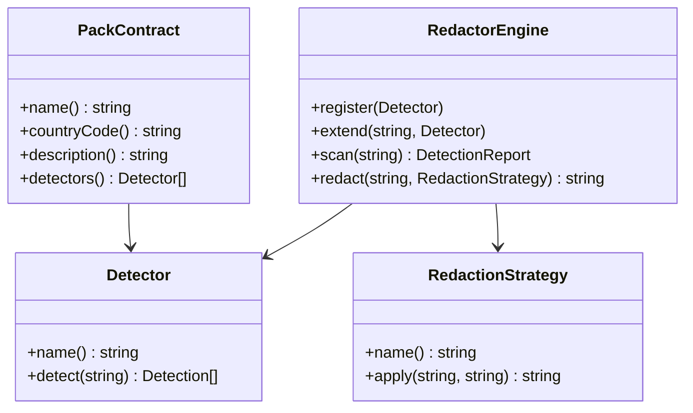

# Design + Mermaid

```mermaid
classDiagram
  class RedactorEngine {
    +register(Detector)
    +extend(string, Detector)
    +scan(string) DetectionReport
    +redact(string, RedactionStrategy) string
  }
  class Detector {
    +name() string
    +detect(string) Detection[]
  }
  class PackContract {
    +name() string
    +countryCode() string
    +description() string
    +detectors() Detector[]
  }
  class RedactionStrategy {
    +name() string
    +apply(string, string) string
  }
  RedactorEngine --> Detector
  PackContract --> Detector
  RedactorEngine --> RedactionStrategy
```

The design goal is replacement-policy independence: a detector never needs to know whether its match will be masked, hashed, tokenised, or dropped.
