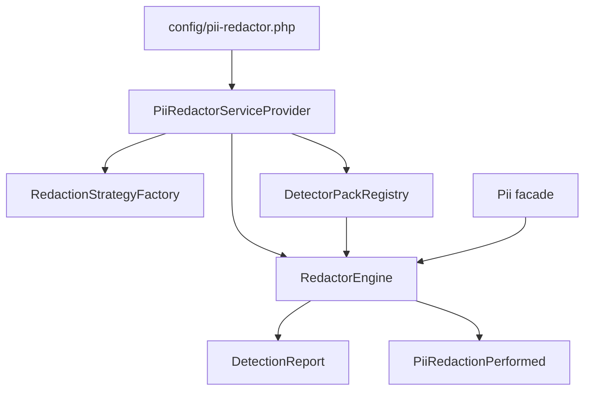

# Architecture Overview

The engine owns registered detectors, the default strategy, the enabled flag, optional audit dispatch, and optional NER. It is otherwise stateless with respect to each input string.

::: grids
  ::: grid
    ::: card "Facade" icon:terminal
    `Pii::redact()`, `Pii::scan()`, and `Pii::extend()` are the host-facing entry points.
    :::
  :::
  ::: grid
    ::: card "Engine" icon:cpu
    Collects detections, resolves overlap, applies strategy replacements, and emits optional audit events.
    :::
  :::
  ::: grid
    ::: card "Reports" icon:file-search
    `DetectionReport` exposes totals, detector counts, samples, and array serialization.
    :::
  :::
:::
