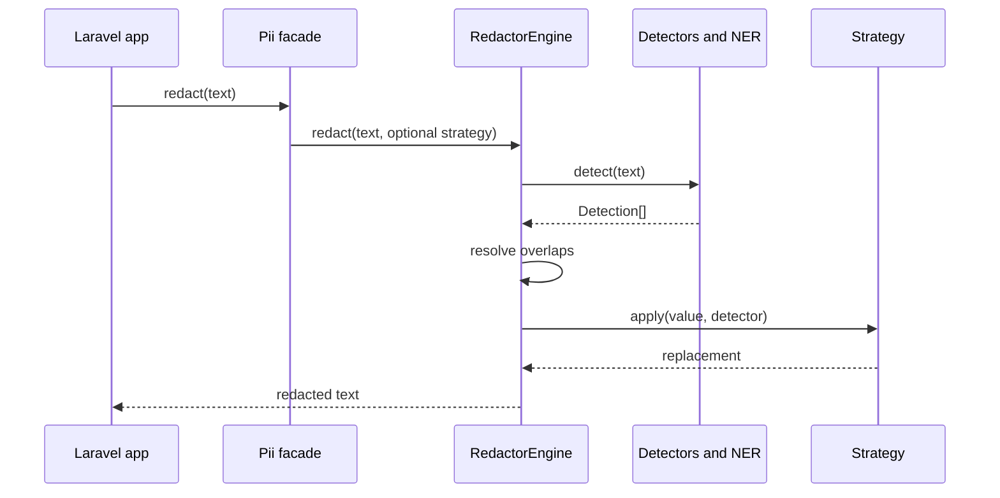

# Pipeline Workflow

::: steps
1. **Register detectors**
   The service provider registers configured international detectors, country-pack detectors, and custom YAML detectors.
2. **Collect detections**
   Each detector returns immutable `Detection` values.
3. **Resolve overlap**
   The earliest span wins, with longer match winning on equal offset.
4. **Replace right-to-left**
   Later spans are replaced first so earlier offsets remain valid.
5. **Emit audit event**
   If enabled and at least one match occurred, counts are dispatched without raw PII.
:::
