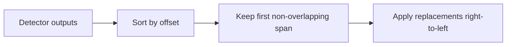

# Teoria

The pipeline separates detection from replacement. Detectors return spans; strategies replace those spans. This lets the same detection report feed masking, hashing, tokenisation, or dropping.

## Overlap policy

When detections overlap, the engine sorts by lower offset, then by longer length for ties. A later overlapping detection is discarded. This makes output stable across runs.

## Hash namespace

For a truncated hash namespace of size `m`, approximate collision probability follows:

$$p \approx 1 - e^{-\frac{n(n-1)}{2m}}$$

Use longer prefixes when unique-value volume grows or when pseudonymous joins are operationally important.
