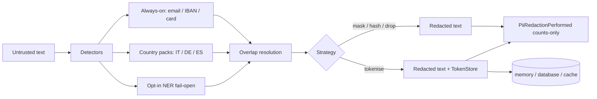

# laravel-pii-redactor


[](https://github.com/padosoft/laravel-pii-redactor/actions/workflows/ci.yml)
[](https://packagist.org/packages/padosoft/laravel-pii-redactor)
[](https://packagist.org/packages/padosoft/laravel-pii-redactor)
[](https://laravel.com)
[](https://github.com/padosoft/laravel-pii-redactor/blob/main/LICENSE)
[](https://packagist.org/packages/padosoft/laravel-pii-redactor)

> **laravel-pii-redactor strips real European PII — Italian `codice fiscale`, German Steuer-ID, Spanish DNI, IBAN, credit cards, email — using deterministic regex + checksum validation, organised into opt-in country packs. Zero external services in the default path, zero per-token cost, GDPR + EU AI Act ready.**

::: callout info "New here? Read this page top to bottom" icon:compass
In five minutes you'll know exactly what this package is, the problem it solves, why it beats every
"hosted DLP" or "throw a regex at it" alternative, and where to click next. Every other page goes
deeper — this one gives you the whole picture.
:::

---

## What it is — in one minute

If you ship anything that touches user text on Laravel — chat logs, support tickets, RAG ingestion,
LLM prompts — you are one careless log line away from leaking a fiscal code into a third party. The
usual options force a bad trade: hand-rolled regexes emit false positives the moment a real
`codice fiscale` appears, hosted services (Presidio / AWS Comprehend / Google DLP) assume US-centric
identifiers and route every line through a network you don't control, and bolting an LLM onto the
pipeline pays per token to solve what is fundamentally a regular-language problem.

`laravel-pii-redactor` covers the **deterministic** layer the right way:

- **Detect with real code, not just shapes** — every first-party detector is a pure function with the
  official checksum: Italian `codice_fiscale` (CIN table from the 1976 Decreto Ministeriale), German
  `steuer_id` (mod-11 ISO 7064), Spanish `dni` (23-letter table), IBAN (mod-97 for **every** ISO 13616
  country), credit card (Luhn).
- **Organise by jurisdiction** — opt-in country packs (`ItalyPack`, `GermanyPack`, `SpainPack`) bundle
  each country's detectors behind one FQCN in config. Operate in Italy only? Keep `ItalyPack`. Across
  the EU? Add the others. Outside Italy? Drop it.
- **Redact your way** — `mask`, `hash`, `tokenise` (reversible) or `drop`, switchable per call, with
  persistent reverse-map storage (memory / database / cache) so a `[tok:…]` round-trips across deploys.

> **In one line:** *the offline, checksum-accurate, EU-first PII layer Laravel never had — detect,
> redact and (when you must) reverse, without sending a single byte to anyone.*

---

## The problem it solves

Every team handling EU personal data hits the same wall: the easy tools are US-shaped and online, and
the offline tools are hand-rolled regexes that fail audits. Here is the gap this package closes.

| Without laravel-pii-redactor | With laravel-pii-redactor |
|---|---|
| A bare `codice fiscale` regex returns false positives on every retry CI run — your "good enough" pattern breaks audits. | Every national ID is validated by its **real checksum** (CIN, mod-11, 23-letter table, Luhn-IT) — shape alone is never enough. |
| Hosted DLP (Presidio / AWS Comprehend / Google DLP) routes every chat line through a US network — a GDPR amplifier with per-character cost. | The default path is **100% offline**: zero external services, **€0** per 1M characters, no transit, no rate limit. |
| An LLM-based redactor pays per token to solve a regular-language problem. | Deterministic regex + checksum — a 1 MB chat log redacts in ~280 ms, identical on every machine. |
| You can only mask — once it's gone, an auditor's lawful access request is unanswerable. | Four strategies including **reversible `tokenise`** with `detokenise()`, backed by a persistent token store that survives deploys + queue restarts. |
| Adding a new country means forking the engine. | **Opt-in country packs** via the `PackContract` interface — add a jurisdiction with one config line; contribute one upstream with a 3-step recipe. |
| Logs leak raw PII just to prove redaction happened. | The opt-in `PiiRedactionPerformed` audit event carries **counts only** — never raw PII or redacted output. GDPR-friendly by construction. |
| Fuzzy names (PERSON / ORG / LOC) slip past pure regex. | Opt-in **HuggingFace + spaCy NER drivers** merge into the same pipeline — and **fail open**, so a NER outage can never block deterministic redaction. |

---

## Who it's for

::: grids
  ::: grid
    ::: card "EU SaaS handling personal data" icon:shield-check
    Chat, tickets, CRM notes, exports — anywhere user text lands. Strip fiscal codes, IBANs and emails before they touch a log, a cache, or a third-party LLM.
    :::
  :::
  ::: grid
    ::: card "RAG & AI pipelines" icon:bot
    Pre-redact prompts and embedding inputs so no raw PII reaches the model or the vector store. Mask stays stable, so your cache hit-rate survives re-ingestion.
    :::
  :::
  ::: grid
    ::: card "Privacy & compliance teams" icon:scale
    GDPR data-minimisation and EU AI Act posture out of the box: offline by default, counts-only audit trail, reversible pseudonymisation for lawful access.
    :::
  :::
  ::: grid
    ::: card "Platform engineers" icon:layers
    A transport-agnostic facade that slots into HTTP middleware, queue jobs, CLI and events identically — with a CI-friendly `pii:scan` command.
    :::
  :::
:::

---

## Why it's different — the moats

Most tools either **match shapes** (cheap, wrong on EU IDs) or **call a hosted service** (accurate, but
online and metered). This package is deterministic, offline, checksum-accurate **and** EU-first.

::: grids
  ::: grid
    ::: card "EU-first via opt-in country packs" icon:map
    `PackContract` + `DetectorPackRegistry` boot jurisdictions from one config array. `ItalyPack` (default), `GermanyPack` and `SpainPack` ship built-in; `FrancePack` / `NetherlandsPack` / `PortugalPack` are community PRs welcome.
    :::
  :::
  ::: grid
    ::: card "Real checksums, not regex shapes" icon:badge-check
    `codice_fiscale` (CIN, DM 1976), `partita_iva` (Luhn-IT), `steuer_id` (mod-11 ISO 7064 §139b AO), `ust_idnr` (BMF Method 30), `dni`/`nie` (23-letter table RD 1553/2005), `cif`, IBAN mod-97. The thing every other EU option gets wrong.
    :::
  :::
  ::: grid
    ::: card "Offline by default, €0 per call" icon:wifi-off
    No external service in the default path. No transit, no rate limit, no per-character bill. The optional NER layer is the only network path — and it's opt-in.
    :::
  :::
  ::: grid
    ::: card "Four strategies, swappable per call" icon:shuffle
    `mask` for human logs, `hash` (deterministic, per-detector namespaced) for cross-record joins, `tokenise` for reversible forensic recovery, `drop` for lossy forwarding — a one-line override, zero detector changes.
    :::
  :::
  ::: grid
    ::: card "Reversible tokens that survive deploys" icon:database
    `TokenStore` with three drivers — `memory` (default), `database` (Eloquent + migration), `cache` (Redis / Memcached / DynamoDB). The same `[tok:…]` detokenises across deploys, queue workers and horizontal scale-out.
    :::
  :::
  ::: grid
    ::: card "Counts-only audit trail" icon:clipboard-check
    The opt-in `PiiRedactionPerformed` event fires after a redaction that found something, carrying detector→count totals — **never** raw PII or redacted text. Proof of redaction without leaking what was redacted.
    :::
  :::
  ::: grid
    ::: card "Pluggable NER that fails open" icon:brain
    `HuggingFaceNerDriver` and `SpaCyNerDriver` (opt-in) catch fuzzy entities and merge into the same overlap-resolution pipeline. On HTTP error they fail open — deterministic redaction never blocks.
    :::
  :::
  ::: grid
    ::: card "YAML custom-rule packs" icon:file-cog
    Register tenant-specific identifiers (professional registry IDs, account codes) from `*.yaml` files — auto-registered at boot when `custom_rules.auto_register = true`, no bootstrap code.
    :::
  :::
  ::: grid
    ::: card "Standalone-agnostic, semver-locked" icon:lock
    Zero coupling to any sister package (enforced by an architecture test), v1.x surface locked under semver, 600+ PHPUnit tests + robustness + perf gates across PHP 8.3/8.4/8.5 × Laravel 12/13.
    :::
  :::
:::

---

## See it: the operator panel

A polished companion admin dashboard ships separately as
[`padosoft/laravel-pii-redactor-admin`](https://github.com/padosoft/laravel-pii-redactor-admin) — a
Laravel 13 + Vite + React + Tailwind console giving operators a safe overview of the engine, detector
hits, token-map activity, audit events, custom-rule health and strategy configuration. It is built on
this package's **secret-free inspector APIs**, so it surfaces runtime state without ever returning
salts, API keys, raw PII or token originals.


---

## laravel-pii-redactor vs. the alternatives

| Capability | **laravel-pii-redactor** | DIY regex | Microsoft Presidio | AWS Comprehend / Google DLP |
|---|:---:|:---:|:---:|:---:|
| Native Laravel facade + `composer require` | ✅ | ➖ | ❌ | ❌ |
| EU national IDs with **real checksum** (CF / Steuer-ID / DNI) | ✅ | ❌ | ➖ | ➖ |
| Operates fully offline (default path) | ✅ | ✅ | ✅ | ❌ |
| Cost per 1M characters | ✅ €0 | ✅ €0 | ➖ | ❌ |
| Reversible pseudonymisation (`detokenise`) | ✅ | ❌ | ❌ | ➖ |
| Cross-deploy persistent reverse map | ✅ | ❌ | ❌ | ❌ |
| Pluggable country-pack architecture | ✅ | ❌ | ❌ | ❌ |
| Counts-only, GDPR-safe audit event | ✅ | ❌ | ❌ | ➖ |
| Opt-in NER (HuggingFace / spaCy) that fails open | ✅ | ❌ | ✅ | ➖ |

> Legend: ✅ built-in · ➖ partial / paid tier / custom code · ❌ not available. Note: Presidio's
> transformer-backed NER is a stronger free-form classifier — and you can plug it (or any HF/spaCy
> model) in via the `NerDriver` interface. The deterministic, EU-aware, offline core is where this
> package is strongest where the others are weakest.

---

## How it fits together

Text enters from any transport, flows through the registered detectors (multi-country always-on +
opted-in country packs + optional NER), overlaps are resolved left-to-right, and the active strategy
replaces each match — optionally persisting a reverse map and firing a counts-only audit event.



The engine is a pure function of `(text, registered detectors)`; overlap is resolved left-to-right,
longer-match-wins on tie.

---

## Start in 30 seconds

::: steps
1. **Install the package**
   ```bash
   composer require padosoft/laravel-pii-redactor
   php artisan vendor:publish --tag=pii-redactor-config
   ```
   Auto-discovery wires the `PiiRedactorServiceProvider` and the `Pii` facade. Set the salt for the
   hash / tokenise strategies in `.env` (treat it like `APP_KEY`):
   ```dotenv
   PII_REDACTOR_STRATEGY=mask
   PII_REDACTOR_SALT=<32+ random characters>
   ```

2. **Redact and scan**
   ```php
   use Padosoft\PiiRedactor\Facades\Pii;

   $clean = Pii::redact('Codice fiscale RSSMRA85T10A562S, IBAN IT60X0542811101000000123456, mail: mario@example.com.');
   // "Codice fiscale [REDACTED], IBAN [REDACTED], mail: [REDACTED]."

   $report = Pii::scan('Telefono +39 333 1234567 e P.IVA 12345678903.');
   // $report->countsByDetector() === ['phone_it' => 1, 'p_iva' => 1]
   ```

3. **Reverse it when an auditor asks** (tokenise + database store)
   ```php
   use Padosoft\PiiRedactor\Strategies\TokeniseStrategy;

   $strategy  = new TokeniseStrategy(salt: env('PII_REDACTOR_SALT'));
   $redacted  = Pii::redact($chatLog, $strategy);   // ship downstream
   $original  = $strategy->detokeniseString($redacted); // rehydrate on the secure side
   ```
:::

**[→ Quickstart](/get-started/quickstart)** · **[→ Installation](/get-started/installation)** · **[→ Worked Example](/guides/worked-example)**

---

## Batteries included for AI-assisted development

This repo ships the **Padosoft AI vibe-coding pack** — a `.claude/` directory with invocable skills
(testid conventions, PHPUnit / Vitest / Playwright authoring, CI-failure investigation, the Copilot
review loop), a pre-push self-review agent, project rules and slash commands. Open the package in
Claude Code, Cursor, Copilot or Codex and your agent already knows the house rules — extend it with a
new detector or country pack in minutes, not days.

---

## Where to go next

::: grids
  ::: grid
    ::: card "Country Packs" icon:map
    How `ItalyPack` / `GermanyPack` / `SpainPack` work and how to build your own. **[Open →](/guides/country-packs)**
    :::
  :::
  ::: grid
    ::: card "Redaction Strategies" icon:shuffle
    Mask vs. hash vs. tokenise vs. drop — which one for which surface. **[Read →](/guides/redaction-strategies)**
    :::
  :::
  ::: grid
    ::: card "Architecture & ADRs" icon:boxes
    The engine flow, contracts, data model and the decisions behind the design. **[Explore →](/architettura/overview)**
    :::
  :::
:::

::: callout tip "Package facts" icon:info
Composer `padosoft/laravel-pii-redactor` · PHP `^8.3` (8.4/8.5) · Laravel `^12 || ^13` · Apache-2.0 ·
[GitHub](https://github.com/padosoft/laravel-pii-redactor) · [Packagist](https://packagist.org/packages/padosoft/laravel-pii-redactor)
:::
